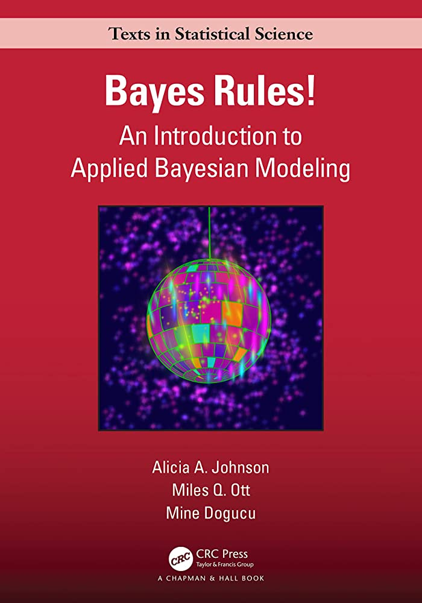

# 9 Linear Discriminant Analysis

**Learning objectives:**

- Purpose of classifiers
- What are generative classifiers
- Gaussian Discriminant Analysis lead to curved decision boundaries
- Linear Discriminant Analysis and linear decision boundaries
- ScikitLearn approaches for Linear / Gaussian Discriminant Analysis
- Explore Naive Bayes classification
- Discuss Fisher's linear discriminant analysis

```{r, message = FALSE, warning = FALSE}
library("bayesrules")
library("dplyr")
library("e1071")
library("ggplot2")
library("ggtext")
library("gt")
library("janitor")
library("magrittr") #need for "." in pipe acts
# library("MASS") #carefully use lda() later to not overwrite select()
library("patchwork")
library("tidyr")

sessionInfo()
```

## Tooling

Scikitlearn:

- [API](https://scikit-learn.org/stable/modules/classes.html#module-sklearn.discriminant_analysis)
- and [chapter](https://scikit-learn.org/stable/modules/lda_qda.html) 

... on Linear / Gaussian Discriminant Analysis

## Classification Models {-}

$p(y=c|x,\theta) = \frac{p(x|y=c,\theta)p(y=c|\theta)}{\Sigma_{c'}{p(x|y=c',\theta)p(y=c'|\theta)}}$

Note:

- Prior $p(y=c|\theta) = \pi_c$
- Class conditional density $p(x|y=c,\theta)$
- Generative classifier

Discriminative classifiers directly model $p(y|x,\theta)$

## Linear discriminant analysis

We want the posterior over classes to be a linear function of $x$

$\log{p(y=c|x,\theta)}=w^Tx+const$

## Gaussian discriminant analysis

$p(x|y = c, θ) = N(x|µ_c , Σ_c )$

Hence,

$p(y = c|x, θ) ∝ π_c N (x|µ_c , Σ_c )$

## Gaussian discriminants -> Quadratic decision boundaries

Log posterior is "The discriminant function"

$\log p(y = c|x, θ) = \log π_c − (1/2)\log|2πΣ_c | − (x − µ_c )^T Σ^{−1}_c (x − µ_c ) + const$

Let $p(y=c|x,\theta)=p(y=c'|x,\theta)$

Then

$(x − µ_c )^TΣ^{−1}_c(x − µ_c) - (x − µ_{c'} )^T Σ^{−1}_{c'} (x − µ_{c'})=f(\pi_c,\pi_c',\Sigma_c,\Sigma_c')$

So the decision boundaries between classes are quadratic in $x$.

GOTO [workbook](https://github.com/probml/pyprobml/blob/master/notebooks/book1/09/discrim_analysis_dboundaries_plot2.ipynb)

## Tied covariance matrices -> Linear decision boundaries

$\log p(y = c|x, θ) = \log π_c − (x − µ_c )^T Σ^{−1} (x − µ_c ) + const$

$= \log π_c − µ^T_c Σ^{−1} µ_c +x^T Σ^−1 µ_c +const − x^T Σ^{−1} x$

$=\gamma_c + x^T\beta_c + \kappa$

So the decision boundaries occur when

$\gamma_c + x^T\beta_c + \kappa = \gamma_{c'} + x^T\beta_{c'} + \kappa$

$x^T(\beta_c - \beta_{c'}) = \gamma_{c'} - \gamma_{c}$

GOTO [workbook](https://github.com/probml/pyprobml/blob/master/notebooks/book1/09/discrim_analysis_dboundaries_plot2.ipynb)

## LDA & Logistic regression

GOTO textbook


## Naive Bayes Example

### Data: Palmer Penguins

There exist multiple penguin species throughout Antarctica, including the *Adelie*, *Chinstrap*, and *Gentoo*. When encountering one of these penguins on an Antarctic trip, we might *classify* its species

$$Y = \begin{cases} A & \text{Adelie} \\ C & \text{Chinstrap} \\ G & \text{Gentoo} \end{cases}$$

	

Example comes from chapter 14 of *Bayes Rules!*

	


$X_{1}$ categorical variable: whether the penguin weighs more than the average 4200 grams

$$X_{1} = \begin{cases} 1 & \text{above-average weight} \\ 0 & \text{below-average weight} \end{cases}$$


Numerical variables:

$$\begin{array}{rcl}
  X_{2} & = & \text{bill length (mm)} \\
  X_{3} & = & \text{flipper length (mm)} \\
\end{array}$$

```{r}
data(penguins_bayes)
penguins <- penguins_bayes

adelie_color = "#fb7504"
chinstrap_color = "#c65ccc"
gentoo_color = "#067476"

penguins |>
  tabyl(species)
```

### Motivation

Here, we have *three* categories, whereas logistic regression is limited to classifying *binary* response variables.  As an alternative, **naive Bayes classification** 

* can classify categorical response variables $Y$ with two or more categories
* doesn’t require much theory beyond Bayes’ Rule
* it’s computationally efficient, i.e., doesn’t require MCMC simulation

But why is it called "naive"?

### One Categorical Predictor

Suppose an Antarctic researcher comes across a penguin that weighs less than 4200g with a 195mm-long flipper and 50mm-long bill. Our goal is to help this researcher identify the species of this penguin: Adelie, Chinstrap, or Gentoo

```{r, echo = FALSE}
penguins |>
  drop_na(above_average_weight) |>
  ggplot(aes(fill = above_average_weight, x = species)) + 
  geom_bar(position = "fill") + 
  labs(title = "<span style = 'color:#067476'>For which species is a<br>below-average weight most likely?</span>",
       subtitle = "(focus on the <span style = 'color:#c65ccc'>below-average</span> category)",
       caption = "R4DS Book Club") +
  scale_fill_manual(values = c("#c65ccc", "#fb7504")) +
  theme_minimal() +
  theme(plot.title = element_markdown(face = "bold", size = 24),
        plot.subtitle = element_markdown(size = 16))
```

<details>
<summary>image code</summary>
```{r, eval = FALSE}
penguins |>
  drop_na(above_average_weight) |>
  ggplot(aes(fill = above_average_weight, x = species)) + 
  geom_bar(position = "fill") + 
  labs(title = "<span style = 'color:#067476'>For which species is a<br>below-average weight most likely?</span>",
       subtitle = "(focus on the <span style = 'color:#c65ccc'>below-average</span> category)",
       caption = "R4DS Book Club") +
  scale_fill_manual(values = c("#c65ccc", "#fb7504")) +
  theme_minimal() +
  theme(plot.title = element_markdown(face = "bold", size = 24),
        plot.subtitle = element_markdown(size = 16))
```
</details>

### Recall: Bayes Rule

$$f(y|x_{1}) = \frac{\text{prior}\cdot\text{likelihood}}{\text{normalizing constant}} = \frac{f(y) \cdot L(y|x_{1})}{f(x_{1})}$$
where, by the Law of Total Probability,

$$\begin{array}{rcl}
f(x_{1} & = & \displaystyle\sum_{\text{all } y'} f(y')L(y'|x_{1}) \\
~ & = & f(y' = A)L(y' = A|x_{1}) + f(y' = C)L(y' = C|x_{1}) + f(y' = G)L(y' = G|x_{1}) \\
\end{array}$$

over our three penguin species.

### Calculation

```{r}
penguins |> 
  select(species, above_average_weight) |> 
  na.omit() |> 
  tabyl(species, above_average_weight) |> 
  adorn_totals(c("row", "col"))
```

Prior probabilities:

$$f(y = A) = \frac{151}{342}, \quad f(y = C) = \frac{68}{342}, \quad f(y = G) = \frac{123}{342}$$

Likelihoods:

$$\begin{array}{rcccl}
  L(y = A | x_{1} = 0) & = & \frac{126}{151} & \approx & 0.8344 \\
  L(y = C | x_{1} = 0) & = & \frac{61}{68} & \approx & 0.8971 \\
  L(y = G | x_{1} = 0) & = & \frac{6}{123} & \approx & 0.0488 \\
\end{array}$$

Total probability:

$$f(x_{1} = 0) = \frac{151}{342}\cdot\frac{126}{151} + \frac{68}{342}\cdot\frac{61}{68} + \frac{123}{342}\cdot\frac{6}{123} = \frac{193}{342}$$

Bayes' Rules:

$$\begin{array}{rcccccl}
  f(y = A | x_{1} = 0) & = & \frac{f(y = A) \cdot L(y = A | x_{1} = 0)}{f(x_{1} = 0)} = \frac{\frac{151}{342}\cdot\frac{126}{151}}{\frac{193}{342}} & \approx & 0.6528 \\
  f(y = C | x_{1} = 0) & = & \frac{f(y = A) \cdot L(y = C | x_{1} = 0)}{f(x_{1} = 0)} = \frac{\frac{68}{342}\cdot\frac{61}{68}}{\frac{193}{342}} & \approx & 0.3161 \\
  f(y = G | x_{1} = 0) & = & \frac{f(y = A) \cdot L(y = G | x_{1} = 0)}{f(x_{1} = 0)} = \frac{\frac{123}{342}\cdot\frac{6}{123}}{\frac{193}{342}} & \approx & 0.0311 \\
\end{array}$$

The posterior probability that this penguin is an Adelie is more than double that of the other two species


### One Numerical Predictor

Let’s ignore the penguin’s weight for now and classify its species using only the fact that it has a 50mm-long bill

```{r, echo = FALSE, message = FALSE, warning = FALSE}
penguins|>
  ggplot(aes(x = bill_length_mm, fill = species)) + 
  geom_density(alpha = 0.7) + 
  geom_vline(xintercept = 50, linetype = "dashed", linewidth = 3) + 
  labs(title = "<span style = 'color:#c65ccc'>For which species is a<br>50mm-long bill the most common?</span>",
       subtitle = "one numerical predictor",
       caption = "R4DS Book Club") +
  scale_fill_manual(values = c(adelie_color, chinstrap_color, gentoo_color)) +
  theme_minimal() +
  theme(plot.title = element_markdown(face = "bold", size = 24),
        plot.subtitle = element_markdown(size = 16))
```

<details>
<summary>image code</summary>
```{r, eval = FALSE, message = FALSE, warning = FALSE}
penguins|>
  ggplot(aes(x = bill_length_mm, fill = species)) + 
  geom_density(alpha = 0.7) + 
  geom_vline(xintercept = 50, linetype = "dashed", linewidth = 3) + 
  labs(title = "<span style = 'color:#c65ccc'>For which species is a<br>50mm-long bill the most common?</span>",
       subtitle = "one numerical predictor",
       caption = "R4DS Book Club") +
  scale_fill_manual(values = c(adelie_color, chinstrap_color, gentoo_color)) +
  theme_minimal() +
  theme(plot.title = element_markdown(face = "bold", size = 24),
        plot.subtitle = element_markdown(size = 16))
```
</details>

Our data points to our penguin being a Chinstrap

* we must weigh this data against the fact that Chinstraps are the rarest of these three species
* difficult to compute likelihood $L(y = A | x_{2} = 50)$

This is where one “*naive*” part of naive Bayes classification comes into play. The naive Bayes method typically assumes that any quantitative predictor, here $X_{2}$, is **continuous** and **conditionally normal**:

$$\begin{array}{rcl}
  X_{2} | (Y = A) & \sim & N(\mu_{A}, \sigma_{A}^{2}) \\
  X_{2} | (Y = C) & \sim & N(\mu_{C}, \sigma_{C}^{2}) \\
  X_{2} | (Y = G) & \sim & N(\mu_{G}, \sigma_{G}^{2}) \\
\end{array}$$

### Prior Probability Distributions

```{r}
# Calculate sample mean and sd for each Y group
penguins |> 
  group_by(species) |> 
  summarize(mean = mean(bill_length_mm, na.rm = TRUE), 
            sd = sd(bill_length_mm, na.rm = TRUE))
```

```{r, eval = FALSE, message = FALSE, warning = FALSE}
penguins |>
  ggplot(aes(x = bill_length_mm, color = species)) + 
  stat_function(fun = dnorm, args = list(mean = 38.8, sd = 2.66), 
                aes(color = "Adelie"), linewidth = 3) +
  stat_function(fun = dnorm, args = list(mean = 48.8, sd = 3.34),
                aes(color = "Chinstrap"), linewidth = 3) +
  stat_function(fun = dnorm, args = list(mean = 47.5, sd = 3.08),
                aes(color = "Gentoo"), linewidth = 3) +
  ...
```

```{r, echo = FALSE, message = FALSE, warning = FALSE}
penguins |>
  ggplot(aes(x = bill_length_mm, color = species)) + 
  stat_function(fun = dnorm, args = list(mean = 38.8, sd = 2.66), 
                aes(color = "Adelie"), linewidth = 3) +
  stat_function(fun = dnorm, args = list(mean = 48.8, sd = 3.34),
                aes(color = "Chinstrap"), linewidth = 3) +
  stat_function(fun = dnorm, args = list(mean = 47.5, sd = 3.08),
                aes(color = "Gentoo"), linewidth = 3) + 
  geom_vline(xintercept = 50, linetype = "dashed") + 
  labs(title = "<span style = 'color:#c65ccc'>Prior Probabilities</span>",
       subtitle = "conditionally normal",
       caption = "R4DS Book Club") +
  scale_color_manual(values = c(adelie_color, chinstrap_color, gentoo_color)) +
  theme_minimal() +
  theme(plot.title = element_markdown(face = "bold", size = 24),
        plot.subtitle = element_markdown(size = 16))
```


<details>
<summary>image code</summary>
```{r, eval = FALSE}
penguins |>
  ggplot(aes(x = bill_length_mm, color = species)) + 
  stat_function(fun = dnorm, args = list(mean = 38.8, sd = 2.66), 
                aes(color = "Adelie"), linewidth = 3) +
  stat_function(fun = dnorm, args = list(mean = 48.8, sd = 3.34),
                aes(color = "Chinstrap"), linewidth = 3) +
  stat_function(fun = dnorm, args = list(mean = 47.5, sd = 3.08),
                aes(color = "Gentoo"), linewidth = 3) + 
  geom_vline(xintercept = 50, linetype = "dashed") + 
  labs(title = "<span style = 'color:#c65ccc'>Prior Probabilities</span>",
       subtitle = "conditionally normal",
       caption = "R4DS Book Club") +
  scale_color_manual(values = c(adelie_color, chinstrap_color, gentoo_color)) +
  theme_minimal() +
  theme(plot.title = element_markdown(face = "bold", size = 24),
        plot.subtitle = element_markdown(size = 16))
```

</details>

Computing the likelihoods in `R`:

```{r, eval = FALSE}
# L(y = A | x_2 = 50) = 2.12e-05
dnorm(50, mean = 38.8, sd = 2.66)

# L(y = C | x_2 = 50) = 0.112
dnorm(50, mean = 48.8, sd = 3.34)

# L(y = G | x_2 = 50) = 0.09317
dnorm(50, mean = 47.5, sd = 3.08)
```

Total probability:

$$f(x_{2} = 50) = \frac{151}{342} \cdot 0.0000212 + \frac{68}{342} \cdot 0.112 + \frac{123}{342} \cdot 0.09317 \approx 0.05579$$

Bayes' Rules:

$$\begin{array}{rcccccl}
  f(y = A | x_{2} = 50) & = & \frac{f(y = A) \cdot L(y = A | x_{1} = 0)}{f(x_{1} = 0)} = \frac{\frac{151}{342} \cdot 0.0000212}{0.05579} & \approx & 0.0002 \\
  f(y = C | x_{2} = 50) & = & \frac{f(y = A) \cdot L(y = C | x_{1} = 0)}{f(x_{1} = 0)} = \frac{\frac{68}{342} \cdot 0.112}{0.05579} & \approx & 0.3992 \\
  f(y = G | x_{2} = 50) & = & \frac{f(y = A) \cdot L(y = G | x_{1} = 0)}{f(x_{1} = 0)} = \frac{\frac{123}{342} \cdot 0.09317}{0.05579} & \approx & 0.6006 \\
\end{array}$$

Though a 50mm-long bill is relatively less common among <span style = 'color:#067476'>Gentoo</span> than among <span style = 'color:#c65ccc'>Chinstrap</span>, it follows that our naive Bayes classification, based on our prior information and penguin’s bill length alone, is that this penguin is a <span style = 'color:#067476'>Gentoo</span> – it has the highest posterior probability.

We’ve now made two naive Bayes classifications of our penguin’s species, one based solely on the fact that our penguin has below-average weight and the other based solely on its 50mm-long bill (in addition to our prior information). And these classifications **disagree**: we classified the penguin as Adelie in the former analysis and Gentoo in the latter. This discrepancy indicates that there’s *room for improvement* in our naive Bayes classification method.


### Two Predictor Variables

```{r, echo = FALSE, message = FALSE, warning = FALSE}
penguins |>
ggplot(aes(x = flipper_length_mm, y = bill_length_mm, 
           color = species)) + 
  geom_point(size = 3) + 
  geom_segment(aes(x = 195, y = 30, xend = 195, yend = 50),
               color = "black", linetype = 2, linewidth = 2) +
  geom_segment(aes(x = 170, y = 50, xend = 195, yend = 50),
               color = "black", linetype = 2, linewidth = 2) +
  labs(title = "<span style = 'color:#c65ccc'>Two Predictor Variables</span>",
       subtitle = "50mm-long bill and 195mm-long flipper",
       caption = "R4DS Book Club") +
  scale_color_manual(values = c(adelie_color, chinstrap_color, gentoo_color)) +
  theme_minimal() +
  theme(plot.title = element_markdown(face = "bold", size = 24),
        plot.subtitle = element_markdown(size = 16))
```

<details>
<summary>image code</summary>
```{r, eval = FALSE, message = FALSE, warning = FALSE}
penguins |>
ggplot(aes(x = flipper_length_mm, y = bill_length_mm, 
           color = species)) + 
  geom_point(size = 3) + 
  geom_segment(aes(x = 195, y = 30, xend = 195, yend = 50),
               color = "black", linetype = 2, linewidth = 2) +
  geom_segment(aes(x = 170, y = 50, xend = 195, yend = 50),
               color = "black", linetype = 2, linewidth = 2) +
  labs(title = "<span style = 'color:#c65ccc'>Two Predictor Variables</span>",
       subtitle = "50mm-long bill and 195mm-long flipper",
       caption = "R4DS Book Club") +
  scale_color_manual(values = c(adelie_color, chinstrap_color, gentoo_color)) +
  theme_minimal() +
  theme(plot.title = element_markdown(face = "bold", size = 24),
        plot.subtitle = element_markdown(size = 16))
```
</details>

Generalizing Bayes' Rule:

$$f(y | x_{2}, x_{3}) = \frac{f(y) \cdot L(y | x_{2}, x_{3})}{\sum_{y'} f(y') \cdot L(y' | x_{2}, x_{3})}$$

Another "naive" assumption of **conditionally independent**:

$$L(y | x_{2}, x_{3}) = f(x_{2}, x_{3} | y) = f(x_{2} | y) \cdot f(x_{3} | y)$$

* mathematically efficient
* but what about correlation?

```{r}
# sample statistics of x_3: flipper length
penguins |> 
  group_by(species) |> 
  summarize(mean = mean(flipper_length_mm, na.rm = TRUE), 
            sd = sd(flipper_length_mm, na.rm = TRUE))
```

Likelihoods of a flipper length of 195 mm:

```{r, eval = FALSE}
# L(y = A | x_3 = 195) = 0.04554
dnorm(195, mean = 190, sd = 6.54)

# L(y = C | x_3 = 195) = 0.05541
dnorm(195, mean = 196, sd = 7.13)

# L(y = G | x_3 = 195) = 0.0001934
dnorm(195, mean = 217, sd = 6.48)
```

Total probability:

$$f(x_{2} = 50, x_{3} = 195) = \frac{151}{342} \cdot 0.0000212 \cdot 0.04554 + \frac{68}{342} \cdot 0.112 \cdot 0.05541 + \frac{123}{342} \cdot 0.09317 \cdot 0.0001931 \approx 0.001241$$

Bayes' Rules:

$$\begin{array}{rcccl}
  f(y = A | x_{2} = 50, x_{3} = 195) & = & \frac{\frac{151}{342} \cdot 0.0000212 \cdot 0.04554}{0.0001931} & \approx & 0.0003 \\
  f(y = C | x_{2} = 50, x_{3} = 195) & = & \frac{\frac{68}{342} \cdot 0.112 \cdot 0.05541}{0.0001931} & \approx & 0.9944 \\
  f(y = G | x_{2} = 50, x_{3} = 195) & = & \frac{\frac{123}{342} \cdot 0.09317 \cdot 0.0001931}{0.0001931} & \approx & 0.0052 \\
\end{array}$$

In conclusion, our penguin is *almost certainly* a <span style = 'color:#c65ccc'>Chinstrap</span>.


## Naive Bayes in R

To implement naive Bayes classification in `R`, we’ll use the `naiveBayes()` function in the `e1071` package (Meyer et al. 2021)

### Models

```{r}
# two models
naive_model_1 <- e1071::naiveBayes(species ~ bill_length_mm, 
                                   data = penguins)
naive_model_2 <- e1071::naiveBayes(species ~ bill_length_mm + flipper_length_mm, 
                            data = penguins)

# our penguin to classify
our_penguin <- data.frame(bill_length_mm = 50, flipper_length_mm = 195)
```

### Predictions

```{r}
predict(naive_model_1, newdata = our_penguin, type = "raw") |>
round(6)
```

```{r}
predict(naive_model_1, newdata = our_penguin)
```
```{r}
predict(naive_model_2, newdata = our_penguin, type = "raw") |>
round(6)
```

```{r}
predict(naive_model_2, newdata = our_penguin)
```

### Validation

### Confusion Matrices

```{r}
penguins <- penguins %>% # keep magrittr pipe?
  mutate(class_1 = predict(naive_model_1, newdata = .),
         class_2 = predict(naive_model_2, newdata = .))
```

```{r}
set.seed(84735)
penguins |> 
  sample_n(4) |> 
  select(bill_length_mm, flipper_length_mm, species, class_1, class_2) |> 
  rename(bill = bill_length_mm, flipper = flipper_length_mm)
```

```{r}
# Confusion matrix for naive_model_1
penguins |> 
  tabyl(species, class_1) |> 
  adorn_percentages("row") |> 
  adorn_pct_formatting(digits = 2) |>
  adorn_ns()
```

* accuracy: 76 percent
* 85 percent of Chinstap penguins are misclassified as Gentoo!

```{r}
# Confusion matrix for naive_model_2
penguins |> 
  tabyl(species, class_2) |> 
  adorn_percentages("row") |> 
  adorn_pct_formatting(digits = 2) |>
  adorn_ns()
```

* accuracy: 95 percent

### Cross-Validation

```{r}
# 10-fold cross-validation
set.seed(84735)
cv_model_2 <- naive_classification_summary_cv(
  model = naive_model_2, data = penguins, y = "species", k = 10)
```

```{r}
cv_model_2$cv
```

## NBC Math

### MLEs

* binary features

$$\hat{\theta}_{dc} = \frac{N_{dc}}{N_{c}}$$

* discrete features

$$\hat{\theta}_{dck} = \displaystyle\frac{N_{dck}}{N_{c}}$$

* numerical features

$$\begin{array}{rcl}
  \hat{\mu}_{dc} & = & \displaystyle\frac{1}{N_{dc}} \displaystyle\sum_{n:y_{n} = c} x_{nd} \\
  \hat{\sigma}_{dc}^{2} & = & \displaystyle\frac{1}{N_{dc}} \displaystyle\sum_{n:y_{n} = c} (x_{nd} - \hat{\mu}_{dc})^{2} \\
\end{array}$$

* MAP: add-one smoothing

$$\begin{array}{rcl}
  \bar{\theta}_{dc} & = & \displaystyle\frac{1 + N_{dc1}}{2 + N_{dc}} \\
  p(y = c|\vec{x}, D) & \propto & \bar{\pi}_{c}\displaystyle\prod_{d}\prod_{k} \bar{\theta}_{dck} \cdot I(x_{d} = k) \\
\end{array}$$

### Imputation

Suppose that we are missing the value of $x_{j}$

* Gaussian discriminant analysis

$$p(y=c|\vec{x}_{i \neq j}, \vec{\theta}) = p(y = c)\displaystyle\sum_{x_{j}} p(x_{j}, \vec{x}_{i \neq j}|y = c, \vec{\theta})$$

* Naive Bayes classifier

$$\displaystyle\sum_{x_{j}} p(x_{j}, x_{i \neq j} | y = c, \vec{\theta}) = \displaystyle\prod_{i \neq j}^{D} p(x_{i}|\vec{\theta}_{dc})$$


## Bayes and Logistic Regression

The class posterior distribution for a Naive Bayes classification model has the same form as multinomial logistic regression:

$$p(y = c|\vec{x}, \vec{\theta}) = \displaystyle\frac{e^{\beta_{c}^{T}\vec{x} + \gamma_{c}}}{\displaystyle\sum_{c'=1}^{C} e^{\beta_{c}^{T}\vec{x} + \gamma_{c}}}$$

### Naive Bayes

$$f(y | x_{1}, x_{2}, ..., x_{p}) = \frac{f(y) \cdot L(y | x_{1}, x_{2}, ..., x_{p})}{\sum_{y'} f(y') \cdot L(y' | x_{1}, x_{2}, ..., x_{p})}$$

* conditionally independent $\rightarrow$ computationally efficient
* generalizes to more than two categories
* assumptions violated commonly in practice
* optimizes joint likelihood $\displaystyle\prod_{n} p(y_{n},\vec{x}_{n}|\vec{\theta})$

### Logistic Regression

$$\log\left(\frac{\pi}{1-\pi}\right) = \beta_{0} + \beta_{1}X_{1} + \cdots + \beta_{k}X_{p}$$

* binary classification
* coefficients $\rightarrow$ illumination of the relationships among these variables
* optimizes conditional likelihood $\displaystyle\prod_{n} p(y_{n}|\vec{x}_{n},\vec{\theta})$


## Covariance Revisited

* Naive Bayes ignored covariance (assumed conditional independence)
* discriminant analyses (generative approach): fit multivariate Gaussians
* want: dimensionality reduction

Fisher's linear discriminant analysis (FLDA) is a hybrid of discriminative and generative techniques, but limited to

$$K \leq C - 1 \text{ dimensions}$$

* $C$: number of classes in response variable
* $D$: number of dimensions in projected space

## FLDA Ideas

* $S_{B}, S_{W}$: scatter matrices (estimate covariance)
* $W$: projection matrix from $D$ to $K$ dimensions

Objective: maximize

$$J(W) = \displaystyle\frac{|W^{T}S_{B}W|}{|W^{T}S_{W}W|}$$

* eigenvalue scenario instead of gradient descent

## PCA Example

<details>
<summary>R setup</summary>
```{r, eval = FALSE, message = FALSE, warning = FALSE}
penguin_2_class <- penguins |>
  filter(species %in% c("Chinstrap", "Gentoo")) |>
  na.omit()

penguin_2_class |>
ggplot(aes(x = flipper_length_mm, y = bill_length_mm, 
           color = species)) + 
  geom_point(size = 3) + 
  labs(title = "Two Predictor Variables",
       subtitle = "50mm-long bill and 195mm-long flipper",
       caption = "Data Science Learning Community") +
  scale_color_manual(values = c(chinstrap_color, gentoo_color)) +
  theme_minimal() +
  theme(plot.title = element_markdown(face = "bold", size = 24),
        plot.subtitle = element_markdown(size = 16))

train_set <- penguin_2_class |>
  select(flipper_length_mm, bill_length_mm)
```
</details>

```{r, echo = FALSE, message = FALSE, warning = FALSE}
penguin_2_class <- penguins |>
  filter(species %in% c("Chinstrap", "Gentoo")) |>
  na.omit()

penguin_2_class |>
ggplot(aes(x = flipper_length_mm, y = bill_length_mm, 
           color = species)) + 
  geom_point(size = 3) + 
  labs(title = "Two Predictor Variables",
       subtitle = "50mm-long bill and 195mm-long flipper",
       caption = "Data Science Learning Community") +
  scale_color_manual(values = c(chinstrap_color, gentoo_color)) +
  theme_minimal() +
  theme(plot.title = element_markdown(face = "bold", size = 14),
        plot.subtitle = element_markdown(size = 12))

train_set <- penguin_2_class |>
  select(flipper_length_mm, bill_length_mm)
```

```{r}
pca_results <- prcomp(train_set, center = TRUE, scale. = TRUE)
```

<details>
<summary>PCA math</summary>
```{r, eval = FALSE, message = FALSE, warning = FALSE}
del_x <- pca_results$rotation[1,1]
del_y <- pca_results$rotation[2,1]
pca_slope <- del_y / del_x

xbar <- mean(train_set$flipper_length_mm, na.rm = TRUE)
ybar <- mean(train_set$bill_length_mm, na.rm = TRUE)
pca_intercept <- ybar - pca_slope * xbar

pca_plot_1 <- penguin_2_class |>
ggplot(aes(x = flipper_length_mm, y = bill_length_mm)) + 
  geom_point(size = 3) + 
  geom_abline(slope = pca_slope, intercept = pca_intercept,
              color = adelie_color, linewidth = 3) +
  labs(title = "Principal Component Analysis",
       subtitle = "<span style = 'color:#fb7504'>first principal component</span>",
       caption = "Data Science Learning Community") +
  # scale_color_manual(values = c(chinstrap_color, gentoo_color)) +
  theme_minimal() +
  theme(plot.title = element_markdown(face = "bold", size = 14),
        plot.subtitle = element_markdown(size = 12))

pca_plot_1
```
</details>

```{r, echo = FALSE, message = FALSE, warning = FALSE}
del_x <- pca_results$rotation[1,1]
del_y <- pca_results$rotation[2,1]
pca_slope <- del_y / del_x

xbar <- mean(train_set$flipper_length_mm, na.rm = TRUE)
ybar <- mean(train_set$bill_length_mm, na.rm = TRUE)
pca_intercept <- ybar - pca_slope * xbar

pca_plot_1 <- penguin_2_class |>
ggplot(aes(x = flipper_length_mm, y = bill_length_mm)) + 
  geom_point(size = 3) + 
  geom_abline(slope = pca_slope, intercept = pca_intercept,
              color = adelie_color, linewidth = 3) +
  labs(title = "Principal Component Analysis",
       subtitle = "<span style = 'color:#fb7504'>first principal component</span>",
       caption = "Data Science Learning Community") +
  # scale_color_manual(values = c(chinstrap_color, gentoo_color)) +
  theme_minimal() +
  theme(plot.title = element_markdown(face = "bold", size = 14),
        plot.subtitle = element_markdown(size = 12))

pca_plot_1
```

* PC1 captures variance of the *entire* data set

<details>
<summary>Projection math</summary>
```{r, eval = FALSE, message = FALSE, warning = FALSE}
train_mat <- as.matrix(train_set)
proj_mat  <- as.matrix(pca_results$rotation[,1])
projection_data <- train_mat %*% proj_mat
projection_df <- cbind(penguin_2_class, projection_data)

pca_plot_2 <- projection_df |>
  ggplot(aes(x = projection_data)) +
  geom_density(aes(fill = species),
               alpha = 0.5) + 
  labs(title = "Classification via <br><span style = 'color:#fb7504'>Principal Component Analysis</span>",
       subtitle = "",
       caption = "Data Science Learning Community",
       x = "(PC1) first principal component",
       y = "") +
  scale_fill_manual(values = c(chinstrap_color, gentoo_color)) +
  theme_minimal() +
  theme(axis.title.y  = element_blank(),
        axis.text.y   = element_blank(),
        axis.ticks.y  = element_blank(),
        plot.title    = element_markdown(face = "bold", size = 24),
        plot.subtitle = element_markdown(size = 16))

pca_plot_2
```
</details>

```{r, echo = FALSE, message = FALSE, warning = FALSE}
train_mat <- as.matrix(train_set)
proj_mat  <- as.matrix(pca_results$rotation[,1])
projection_data <- train_mat %*% proj_mat
projection_df <- cbind(penguin_2_class, projection_data)

pca_plot_2 <- projection_df |>
  ggplot(aes(x = projection_data)) +
  geom_density(aes(fill = species),
               alpha = 0.5) + 
  labs(title = "Classification via <br><span style = 'color:#fb7504'>Principal Component Analysis</span>",
       subtitle = "",
       caption = "Data Science Learning Community",
       x = "(PC1) first principal component",
       y = "") +
  scale_fill_manual(values = c(chinstrap_color, gentoo_color)) +
  theme_minimal() +
  theme(axis.title.y  = element_blank(),
        axis.text.y   = element_blank(),
        axis.ticks.y  = element_blank(),
        plot.title    = element_markdown(face = "bold", size = 14),
        plot.subtitle = element_markdown(size = 12))

pca_plot_2
```


## FLDA Example

```{r}
lda_model <- MASS::lda(bill_length_mm ~ flipper_length_mm, 
                       data = train_set)
```

<details>
<summary>LDA math</summary>
```{r, eval = FALSE, message = FALSE, warning = FALSE}
del_x <- 1
del_y <- lda_model$scaling[1,1]
lda_slope <- del_y / del_x

xbar <- mean(train_set$flipper_length_mm, na.rm = TRUE)
ybar <- mean(train_set$bill_length_mm, na.rm = TRUE)
lda_intercept <- ybar - lda_slope * xbar

lda_plot_1 <- penguin_2_class |>
ggplot(aes(x = flipper_length_mm, y = bill_length_mm, 
           color = species)) + 
  geom_point(size = 3) + 
  geom_abline(slope = lda_slope, intercept = lda_intercept,
              color = adelie_color, linewidth = 3) +
  labs(title = "Linear Discriminant Analysis",
       subtitle = "<span style = 'color:#fb7504'>first linear discriminant</span>",
       caption = "Data Science Learning Community") +
  scale_color_manual(values = c(chinstrap_color, gentoo_color)) +
  theme_minimal() +
  theme(plot.title = element_markdown(face = "bold", size = 24),
        plot.subtitle = element_markdown(size = 16))

lda_plot_1
```
</details>

```{r, echo = FALSE, message = FALSE, warning = FALSE}
del_x <- 1
del_y <- lda_model$scaling[1,1]
lda_slope <- del_y / del_x

xbar <- mean(train_set$flipper_length_mm, na.rm = TRUE)
ybar <- mean(train_set$bill_length_mm, na.rm = TRUE)
lda_intercept <- ybar - lda_slope * xbar

lda_plot_1 <- penguin_2_class |>
ggplot(aes(x = flipper_length_mm, y = bill_length_mm, 
           color = species)) + 
  geom_point(size = 3) + 
  geom_abline(slope = lda_slope, intercept = lda_intercept,
              color = adelie_color, linewidth = 3) +
  labs(title = "Linear Discriminant Analysis",
       subtitle = "<span style = 'color:#fb7504'>first linear discriminant</span>",
       caption = "Data Science Learning Community") +
  scale_color_manual(values = c(chinstrap_color, gentoo_color)) +
  theme_minimal() +
  theme(plot.title = element_markdown(face = "bold", size = 14),
        plot.subtitle = element_markdown(size = 12))

lda_plot_1
```

<details>
<summary>Projection math</summary>
```{r, eval = FALSE, message = FALSE, warning = FALSE}
train_mat <- as.matrix(train_set)
proj_mat  <- as.matrix(c(1, lda_model$scaling[1,1]))
projection_data <- train_mat %*% proj_mat
projection_df <- cbind(penguin_2_class, projection_data)

lda_plot_2 <- projection_df |>
  ggplot(aes(x = projection_data)) +
  geom_density(aes(fill = species),
               alpha = 0.5) + 
  labs(title = "Classification via <br><span style = 'color:#fb7504'>Linear Discriminant Analysis</span>",
       subtitle = "",
       caption = "Data Science Learning Community",
       x = "(LDA1) first linear discriminant",
       y = "") +
  scale_fill_manual(values = c(chinstrap_color, gentoo_color)) +
  theme_minimal() +
  theme(axis.title.y  = element_blank(),
        axis.text.y   = element_blank(),
        axis.ticks.y  = element_blank(),
        plot.title    = element_markdown(face = "bold", size = 24),
        plot.subtitle = element_markdown(size = 16))

lda_plot_2
```

</details>

```{r, echo = FALSE, message = FALSE, warning = FALSE}
train_mat <- as.matrix(train_set)
proj_mat  <- as.matrix(c(1, lda_model$scaling[1,1]))
projection_data <- train_mat %*% proj_mat
projection_df <- cbind(penguin_2_class, projection_data)

lda_plot_2 <- projection_df |>
  ggplot(aes(x = projection_data)) +
  geom_density(aes(fill = species),
               alpha = 0.5) + 
  labs(title = "Classification via <br><span style = 'color:#fb7504'>Linear Discriminant Analysis</span>",
       subtitle = "",
       caption = "Data Science Learning Community",
       x = "(LDA1) first linear discriminant",
       y = "") +
  scale_fill_manual(values = c(chinstrap_color, gentoo_color)) +
  theme_minimal() +
  theme(axis.title.y  = element_blank(),
        axis.text.y   = element_blank(),
        axis.ticks.y  = element_blank(),
        plot.title    = element_markdown(face = "bold", size = 14),
        plot.subtitle = element_markdown(size = 12))

lda_plot_2
```


## FLDA vs PCA

```{r, echo = FALSE, message = FALSE, warning = FALSE}
#patchwork

(pca_plot_1 + lda_plot_1) / (pca_plot_2 + lda_plot_2)
```


## Discriminative vs Generative

### Advantages of discriminative classifiers

* Better predictive accuracy
* Can handle feature preprocessing
* Well-calibrated probabilities

### Advantages of generative classifiers

* Easy to fit
* Can easily handle missing input features
* Can fit classes separately
* Can handle unlabeled training data
* May be more robust to spurious features

```{r, echo = FALSE, message = FALSE, warning = FALSE}
df_for_comparison_table <- data.frame(
  discriminative_classifiers = c("Logistic regression", "Support vector machines", "Neural networks", "Nearest neighbor", "Conditional Random Fields", "Random Forests"),
  generative_classifiers = c("Naive Bayes", "Bayesian networks", "Markov random fields", "Hidden Markov Models", "Latent Dirichlet Allocation", "Generative Adversarial Networks")
)

df_for_comparison_table |>
  gt() |>
  cols_align(align = "center") |>
  cols_label(
    discriminative_classifiers ~ "Discriminative Classifiers",
    generative_classifiers ~ "Generative Classifiers"
  ) |>
  tab_header(
    title = "Types of Classification Techniques",
    subtitle = ""
  ) |>
  tab_footnote(
    footnote = "Source: https://www.analyticsvidhya.com/blog/2021/07/deep-understanding-of-discriminative-and-generative-models-in-machine-learning/",
    locations = cells_title(groups = "title")
  ) |>
  tab_style(
    style = list(cell_fill(color = "#F9E3D6")),
    locations = cells_body(columns = discriminative_classifiers)
  ) |>
  tab_style(
    style = list(cell_fill(color = "lightcyan")),
    locations = cells_body(columns = generative_classifiers)
  )
```


## Meeting Videos {-}

### Cohort 1 {-}

`r knitr::include_url("https://www.youtube.com/embed/URL")`

<details>
<summary> Meeting chat log </summary>

```
00:51:52    Heidi L Wallace:    I have to jump before my next meeting, thank you so much  for this!
```
</details>
